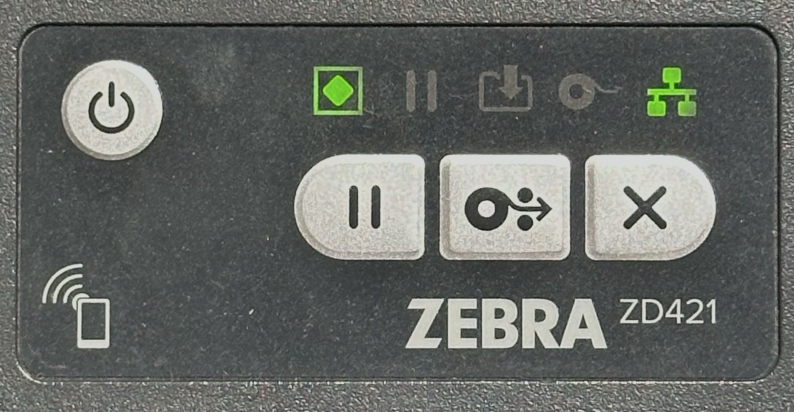
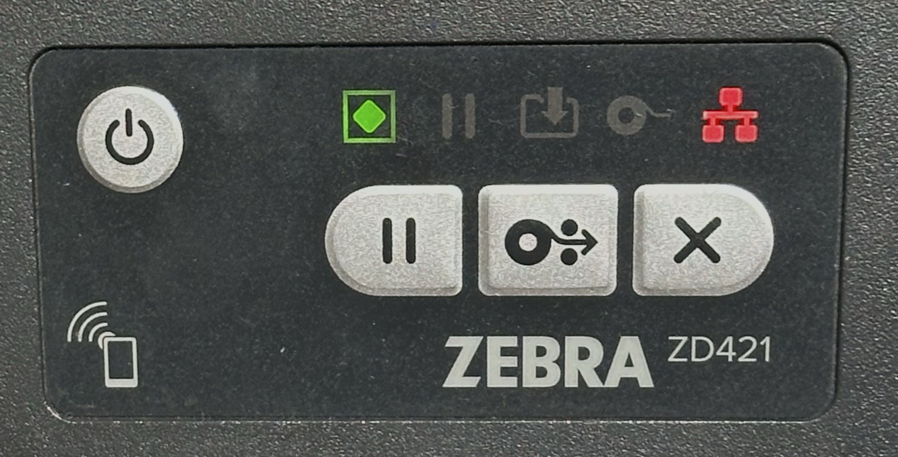
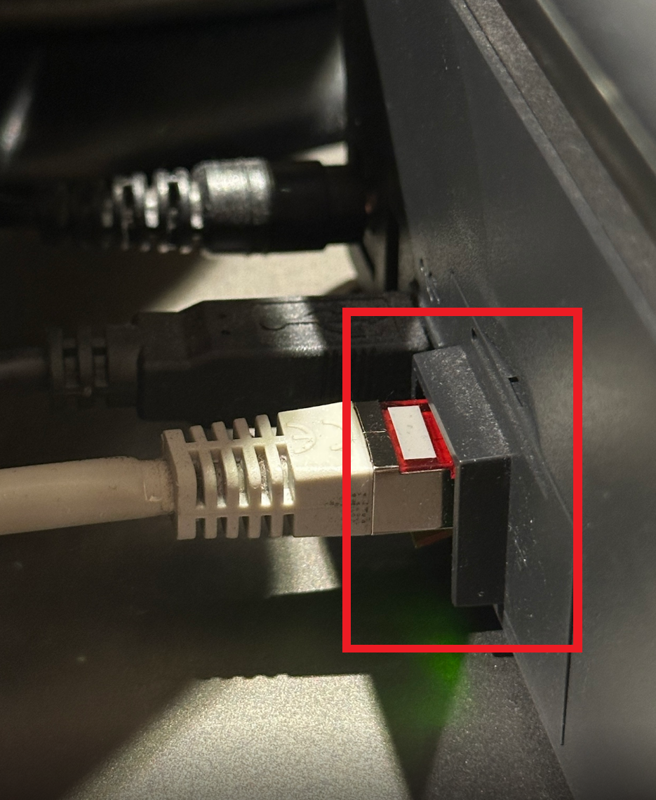
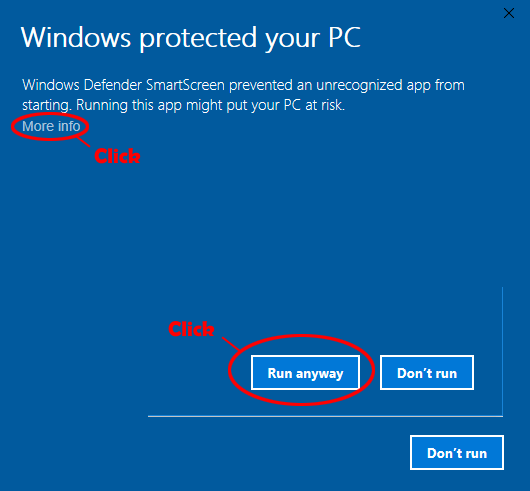
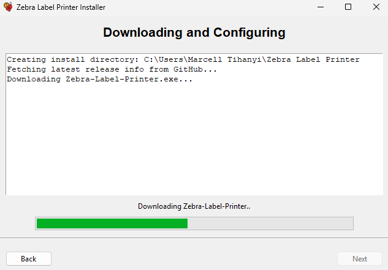
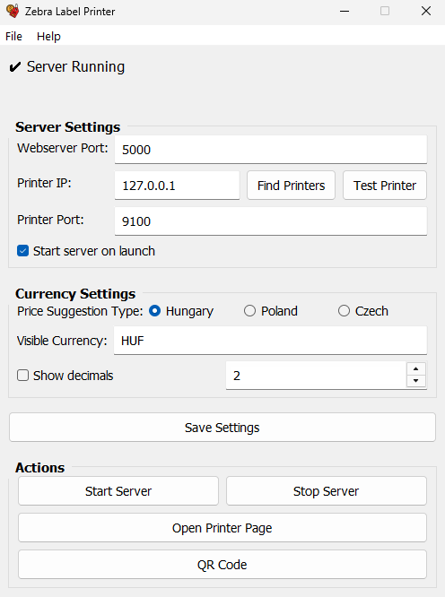

# Telepítési útmutató

## Előkészület

A Zebra Label Printer telepítése előtt ellenőrizd, hogy az üzlet megfelel a kompatibilitási követelményeknek.
Ellenőrizd, hogy a Zebra nyomtató hálózaton van-e: nyomd meg az X gombot a nyomtatón. Ha a hálózat (Ethernet) ikon zöld, akkor a nyomtató csatlakoztatva van.

| Állapot | Kép |
|--------|-----|
| Nyomtató rendben |  |
| Nyomtató nincs csatlakoztatva |  |

**Ha hálózati problémát tapasztalsz, ellenőrizd az alábbiakat:**

Győződj meg róla, hogy az Ethernet kábel be van dugva a nyomtató alábbi portjába:

## Telepítés lépései

1. Töltsd le a legfrissebb `zlp-installer.exe` verziót a kiadások oldaláról. (Az alábbi linken a letöltési oldalra jutsz.)

    [zlp-installer.exe letöltése](https://github.com/TMarccci/Zebra-Label-Printer/releases/latest)

2. Indítsd el az alkalmazást, és fogadd el a Windows SmartScreen figyelmeztetést, ha megjelenik.

3. Kövesd a képernyőn megjelenő utasításokat.
4. Fejezd be a telepítő varázslót (ha tovább tart, az normális — nyugodtan igyál egy kávét ☕).

5. Indítsd el az alkalmazást az asztali ikonról vagy a Start menüből. (Ha a telepítés után nem nyílt meg automatikusan.)

## Első beállítás

1. Nyisd meg a `Zebra Label Printer.exe` fájlt (ha a telepítés után nem indult el automatikusan).
2. A beállítási ablakban kattints a `Find Printers` gombra, hogy a rendszer felderítse a hálózaton lévő Zebra nyomtatókat.
3. Válaszd ki a nyomtatót a listából. Küldhetsz próba nyomtatást is, hogy megerősítsd, a megfelelő eszközről van szó.
4. Ha a nyomtató nem található, add meg kézzel az IP címet és a portot (általában `9100`).
5. Válaszd ki a pénznemet, az árjavaslatokat és a tizedesjegyek beállításait az üzlet igényei szerint.
6. Mentsd el a beállításokat.
7. Kattints a `Start Server` gombra (ha nem indult el automatikusan).
8. A webes felület megnyitásához kattints az `Open Web Interface` gombra.

(Konfigurációs ablak példa)

---

**Megjegyzések:**
- Ha bármilyen problémát tapasztalsz a telepítés vagy beállítás során, nézd meg a README.md hibaelhárítás részét, vagy vedd fel a kapcsolatot a támogatással.
- Ha a telepítésnél az alapértelmezett beállításokat hagytad, az alkalmazás létrehoz egy asztali ikont, és a Windowszal együtt indul. (Elég az `Open Web Interface` gombra kattintani a használat elkezdéséhez.)
- A webes felület hivatkozását elmentheted könyvjelzőként a böngészőben.

## Az első címke nyomtatása

1. A webes felületen válaszd ki az ár módot: „SALE PRICE” (akciós ár) vagy „NORMAL PRICE” (normál ár).
2. Add meg az árat a javaslat gombokkal vagy kézzel beírva.
3. Állítsd be a nyomtatandó címkék mennyiségét (alapértelmezés szerint 1, ha nincs megadva).
4. Kattints a `Submit` gombra a címke nyomtatásához.
5. Ellenőrizd, hogy a címke megfelelően kinyomtatódott a Zebra nyomtatón.